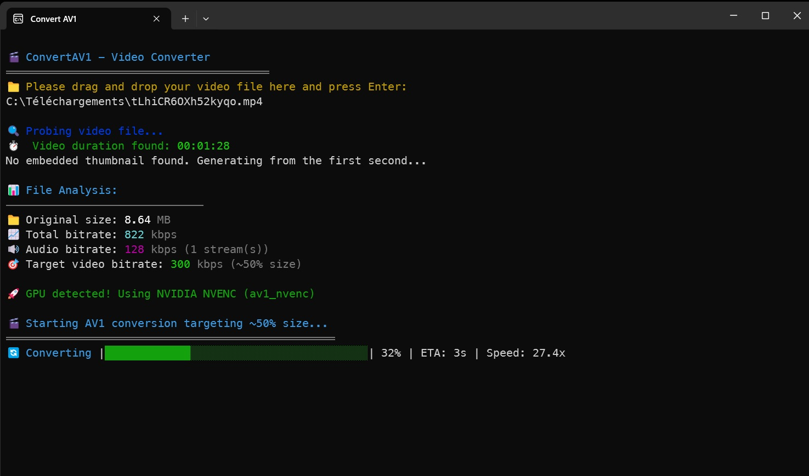

## convert-av1 (Bun/TypeScript CLI)

Converts a video to AV1 with maximum visual fidelity while achieving roughly 50% of its original file size. Preserves audio, subtitles, and generates a thumbnail from the video. Uses NVIDIA NVENC AV1 when available (RTX 40-series), otherwise libsvtav1 with quality-optimized settings.

Easy to use! Just drag and drop your file in the app and press Enter!



## Download

**[📥 Download Latest Release](https://github.com/StephanOrgiazzi/convertav1/releases/latest)**

Pre-built executables are available for Windows, macOS, and Linux. No installation required - just download and run!

## How It Works

The application is built on top of **ffmpeg**, the industry-standard multimedia framework. ffmpeg and ffprobe are **bundled directly into the executable** - no separate installation required! The app performs intelligent video conversion with the following workflow:

### 1. **Input Analysis & Validation**

- Accepts video file path via command line argument or interactive prompt
- Validates file existence and accessibility
- Uses bundled ffprobe to analyze video properties (duration, streams, etc.)

### 2. **Thumbnail Processing**

- Generates thumbnail from video frame at 1 second mark
- Thumbnails are temporarily stored and cleaned up after conversion

### 3. **Smart Bitrate Calculation**

- Analyzes original video size and duration to calculate total bitrate
- Detects audio streams and estimates audio bitrate requirements
- **Target**: Achieves ~50% of original file size while maintaining quality
- Automatically adjusts video bitrate: `target_video_bitrate = (original_total_bitrate × 0.5) - audio_bitrate`

### 4. **Encoder Selection & Optimization**

- **NVIDIA NVENC AV1** (when available):
  - Hardware acceleration for RTX 40-series GPUs
  - Optimized for speed and quality
  - Uses VBR (Variable Bitrate) with CQ 28, preset P6, HQ tuning
- **libsvtav1** (fallback):
  - CPU-based encoding with quality-focused settings
  - CRF 30, preset 8, tune 0

### 5. **Conversion Process**

- Preserves all audio streams and subtitles without re-encoding
- Embeds thumbnail as attached picture stream
- Uses `-movflags +faststart` for web-optimized streaming
- Real-time progress tracking with ETA calculation
- Outputs to `{filename}_av1.mp4` in the same directory

## Dev Requirements

- Bun installed

## Dev Usage

Install dependencies:

```bash
bun install
```

### **Interactive Mode**

Run without arguments to get prompted for file path:

```bash
bun run src/convert_av1.ts
# or use the start script
bun start
```

### **Command Line Mode**

Pass the video file path directly:

```bash
bun run src/convert_av1.ts "C:/path/to/video.mp4"
# or use the start script
bun start "C:/path/to/video.mp4"
```

## Build and Bundle Executables

### **Quick Commands**

#### Windows

Generate icon, build executable, and create desktop shortcut:

```bash
bun run bundle:win
```

This creates:

- `assets/icon.ico` and `assets/icon-256.png`
- `convert-av1-win.exe` (bundled with ffmpeg/ffprobe)
- Desktop shortcut `Convert AV1.lnk` with the icon

#### macOS

Generate icon and build executables:

```bash
bun run icns:from-svg
bun run build:mac-x64     # Intel
bun run build:mac-arm64   # Apple Silicon
```

Create .app bundles with icons:

```bash
bun run bundle:mac-x64     # Creates Convert AV1.app (Intel)
bun run bundle:mac-arm64   # Creates Convert AV1.app (Apple Silicon)
```

#### Linux

Generate icon and build executables:

```bash
bun run png:from-svg
bun run build:linux-x64   # x64
bun run build:linux-arm64 # ARM64
```

Create Linux app bundles with desktop files:

```bash
bun run bundle:linux-x64   # Creates convert-av1-linux-x64-app
bun run bundle:linux-arm64 # Creates convert-av1-linux-arm64-app
```

#### All Platforms

Bundle all platforms at once:

```bash
bun run bundle:all  # Creates Windows, macOS, and Linux apps
```

### **Individual Build Steps**

If you prefer to run steps separately:

```bash
# Windows
bun run icon:from-svg     # Generate Windows .ico
bun run build:win         # Build Windows .exe
bun run shortcut:win      # Create Windows shortcut

# macOS
bun run icns:from-svg     # Generate macOS .icns
bun run build:mac-x64     # Build macOS Intel binary
bun run build:mac-arm64   # Build macOS Apple Silicon binary
bun run bundle:mac-x64    # Bundle Intel binary into .app
bun run bundle:mac-arm64  # Bundle Apple Silicon binary into .app

# Linux
bun run png:from-svg      # Generate Linux .png icon
bun run build:linux-x64   # Build Linux x64 binary
bun run build:linux-arm64 # Build Linux ARM64 binary
bun run bundle:linux-x64  # Bundle x64 binary into app directory
bun run bundle:linux-arm64 # Bundle ARM64 binary into app directory
```

### **Output Files**

After building, you'll have:

- **Windows**: `convert-av1-win.exe` + desktop shortcut with icon
- **macOS Intel**: `convert-av1-macos-x64` + `Convert AV1.app` bundle
- **macOS Apple Silicon**: `convert-av1-macos-arm64` + `Convert AV1.app` bundle
- **Linux x64**: `convert-av1-linux-x64` + `convert-av1-linux-x64-app/` bundle
- **Linux ARM64**: `convert-av1-linux-arm64` + `convert-av1-linux-arm64-app/` bundle
- **Assets**: `assets/icon.ico`, `assets/icon.icns`, `assets/icon.png`, `assets/icon-256.png`

### **Linux App Bundle Contents**

The Linux app bundles include:

- **Binary**: The executable in `bin/` directory
- **Desktop File**: `.desktop` file for system integration in `share/applications/`
- **Icon**: PNG icon in `share/icons/`
- **Install Script**: `install.sh` - copies files to system directories and registers the application
- **Uninstall Script**: `uninstall.sh` - removes installed files and desktop integration
- **README**: Installation and usage instructions

**Installation**:

```bash
cd convert-av1-linux-x64-app
./install.sh
```

**Uninstallation**:

```bash
cd convert-av1-linux-x64-app
./uninstall.sh
```

## Technical Details

### **Supported Input Formats**

- Any video format that ffmpeg can read (MP4, AVI, MKV, MOV, etc.)
- Preserves original audio codecs and subtitle streams
- Maintains video metadata and stream dispositions

### **Output Specifications**

- **Container**: MP4 with AV1 video codec
- **Video**: AV1 encoded with optimized settings for ~50% size reduction
- **Audio**: Stream-copied (no re-encoding, preserves quality)
- **Subtitles**: Stream-copied (no re-encoding)
- **Thumbnail**: Embedded as attached picture stream
- **Optimization**: `+faststart` flag for immediate web playback

### **Performance Characteristics**

- **Hardware Acceleration**: NVIDIA NVENC AV1 (RTX 40-series) - ~5-10x faster
- **CPU Encoding**: libaom-av1 with multi-threading optimization
- **Memory Usage**: Minimal - processes video in streaming fashion
- **Progress Tracking**: Real-time with ETA calculation and percentage display

## Project Structure

```
convertav1/
├── src/
│   └── convert_av1.ts    # Main conversion script
├── scripts/               # Build and icon generation scripts
├── assets/                # Icons and assets
├── package.json           # Dependencies and build scripts
├── tsconfig.json          # TypeScript configuration
└── README.md              # This file
```

## Important Notes

- **Cross-compilation**: Generally works via Bun's `--target` flag, but always test the produced binary on its target OS
- **Bundled dependencies**: The executable extracts bundled ffmpeg/ffprobe to a temp path at runtime
- **Windows limitation**: The .exe itself cannot be modified without breaking it; use the desktop shortcut for the icon
- **macOS advantage**: The .app bundles include the icon and can be double-clicked to run
- **Linux advantage**: The app bundles include desktop files, icons, and install/uninstall scripts for easy system integration

## License

This project is licensed under the MIT License - see the [LICENSE](LICENSE) file for details.

---

**Note**: This tool is designed for personal use and video optimization. Always ensure you have the rights to convert any video content.
